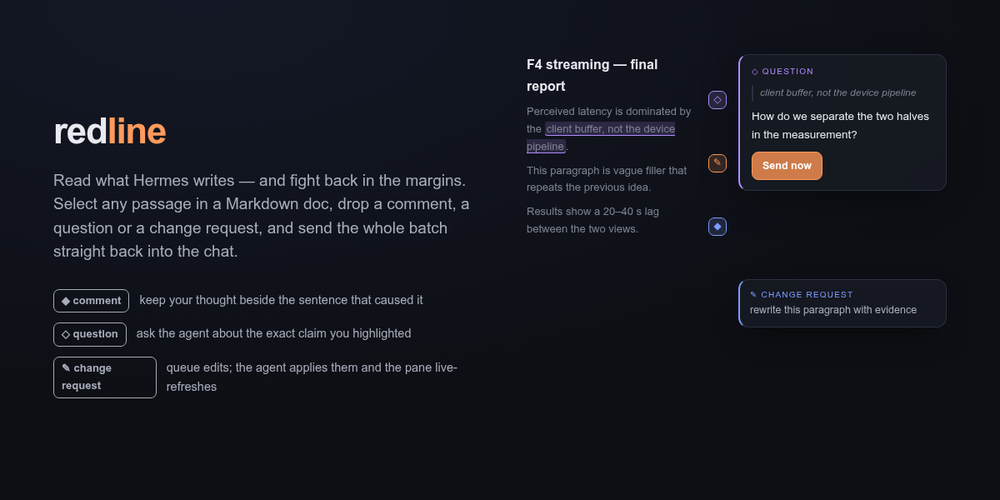
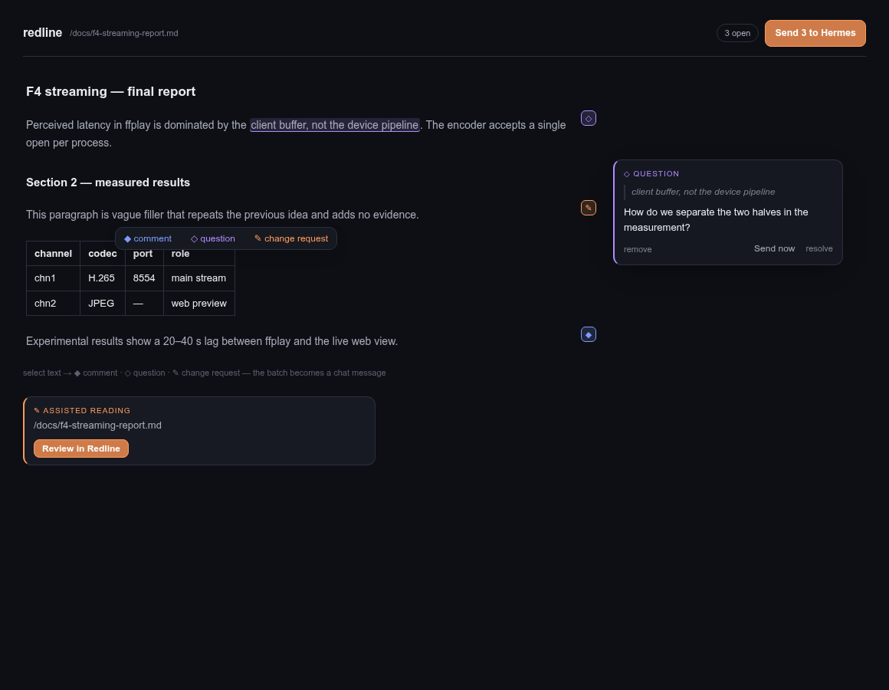

# redline

**Read what Hermes writes — and fight back in the margins.**

Hermes writes a lot of Markdown for you: reports, plans, docs, analyses. Reading it in chat is fine. *Reviewing* it in chat is painful — you copy a paragraph, paste it, explain which paragraph, hope the agent gets it.

Redline turns any Markdown document into a review surface inside Hermes Desktop. Select a sentence. Drop a **comment**, a **question**, or a **change request** right on top of it. Queue as many as you like — or fire one immediately. The whole batch lands back in the chat as a structured message the agent acts on, and the pane live-refreshes as it edits the file.



## What it looks like



- When the agent writes a reviewable Markdown document with Hermes file tools, Redline automatically adds its card to the final response; agents can still emit a card manually when needed.
- One click opens the document in a pane docked beside the chat — same reading surface as the chat, rendered with the app's own Markdown renderer and your theme's colors.
- Select any passage → a pill offers ◆ comment · ◇ question · ✎ change request.
- Each annotation becomes a floating card over the text, with a small marker in the margin so you always see where the open threads are.
- Annotations persist in a sidecar next to your document (`doc.md.redline.json`) — close the pane, come back tomorrow, your review is still there.

## The loop

```text
agent writes doc.md
   → ::redline{file="doc.md"} card in the chat
      → you read, select, annotate
         → batch (or single) back into the composer
            → agent edits the file
               → the pane refreshes under you
```

Two ways to send, your call per annotation:

- **Add to list** — accumulate a review, send it as one batch (`Send 4 to Hermes`). The agent answers point by point, numbered to match your boxes.
- **Send now** — one hot take, fired immediately, without touching the rest of the list.

## Why it helps day to day

- **Reviews stop being copy-paste archaeology.** The quote travels with the note; the agent always knows exactly which passage you mean.
- **You review at reading speed.** Comment while you read, decide later whether to send.
- **Long documents become tractable.** A 10-page report reviewed in place beats a 10-message chat thread about it.
- **Nothing is lost.** The sidecar keeps open threads, resolved threads, and what was already sent — across restarts.

## Install

Copy this directory to `~/.hermes/plugins/redline` (or the equivalent plugins directory for your Hermes profile), enable it in **Capabilities → Plugins**, and restart the gateway so the backend routes mount. From the plugin catalog:

```bash
hermes plugins install redline
```

## How it works

Three pieces, no core patches — everything through the Desktop plugin SDK:

| piece | role |
|---|---|
| `desktop/plugin.js` | transcript directive, review pane, selection pill, floating cards, margin markers, batch composer |
| `dashboard/plugin_api.py` | tiny FastAPI backend: reads the document, persists annotations |
| `<document>.md.redline.json` | sidecar beside your document — the annotation list, yours to keep |

Agent-side hooks remember eligible Markdown files written via `write_file` or `patch` and append the card directive automatically at the end of the response. The agent side is otherwise just a message format: a batch arrives as `🔴 redline — review of <path> (N notes):` with numbered quotes and requests, which any Hermes agent can act on.

## Disclosure

- Reads any local `.md`/`.markdown` path you name (max 1 MB) and writes only the sidecar beside it. It is a local review tool, not a sandboxed document service.
- No network calls beyond the local Hermes gateway. No credentials touched. No telemetry.
- The pane polls the backend every 3 s while open so agent edits show up live.
- The `transform_llm_output` hook modifies the final agent response by appending a `::redline{file="..."}` directive after an eligible Markdown file is delivered. Hermes renders that trailing directive as the review card, using the same directive mechanism as core previews.

## Roadmap

- Source-code review for files such as `.py` and `.sh` is planned for v0.2; current releases review Markdown only.

## Known limits

- One annotation card open at a time (click a margin marker to switch).
- Markdown renders through the chat's own renderer — tables, lists, code blocks yes; syntax highlighting depends on the chat provider.
- Block anchors are paragraph indices captured at annotation time; heavily rewritten documents may need a re-select.

MIT licensed. Feedback and forks welcome.
